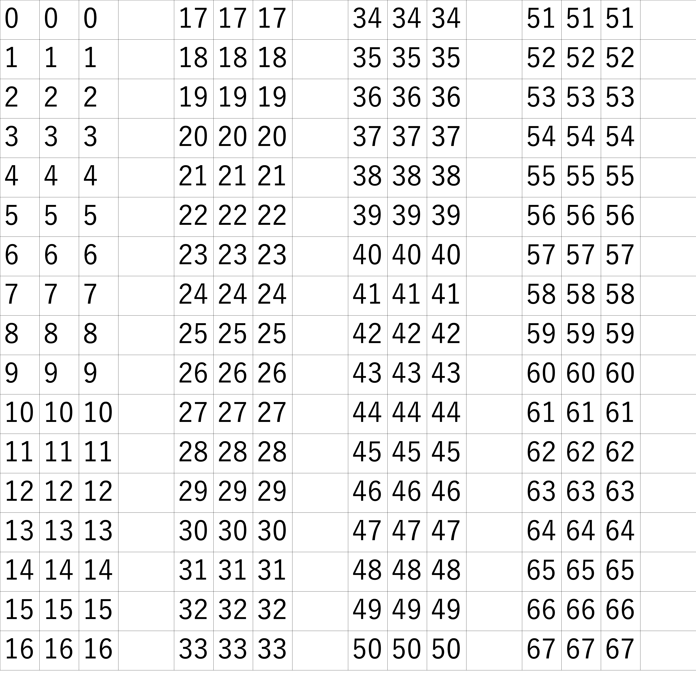

# gridtex maker

It is a python tool to create a grid-like texture file for inputting images  

Usage  
```py
python run.py level "input images directory path" "output image file path"
```
level:  
1, 141 x 32 blocks (29 x 29 pixels)  
2, 70 x 16 blocks (58 x 58 pixels)  
3, 35 x 8 blocks (116 x 116 pixels)  
4, 17 x 4 blocks (232 x 232 pixels)  
5, 8 x 2 blocks (464 x 464 pixels)  
6, 4 x 1 blocks (928 x 928 pixels)  
7, error  

level 4 example:  
If there is a png file, replace the number with an image  


